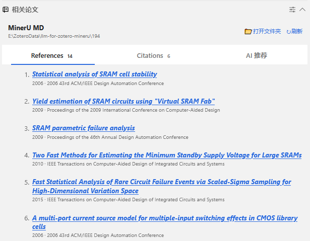
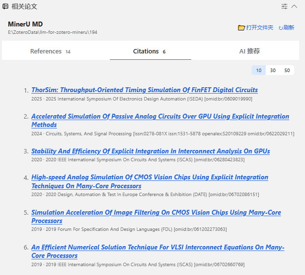
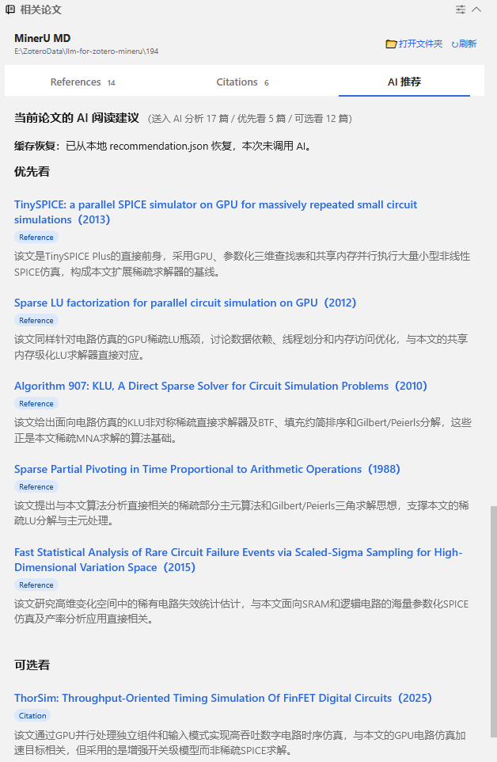
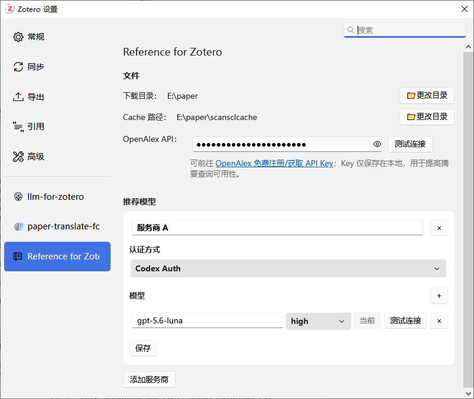

# Reference for Zotero

Reference for Zotero 是一个 Zotero 9 Reader 插件。它把论文末尾那串难以阅读的参考文献，整理成可以查看、核验和继续追踪的论文列表。你可以留在 Zotero 里看当前论文引用了谁、后来谁引用了它，还能补全摘要，让 AI 帮你判断下一步先读什么。

> Reference for Zotero is a Zotero 9 Reader extension for exploring references, citing papers, abstracts, and AI-assisted reading suggestions without leaving the reading workflow.

## 为什么需要它

读论文时遇到一条感兴趣的引用，通常要复制题名、打开浏览器、搜索、核对年份和作者，再回到 PDF。想了解后续研究，还得换一个数据库查 cited-by。几次来回之后，刚才读到哪里都容易忘。

Reference for Zotero 把这些动作放回 Reader 侧栏。它读取当前附件已有的 MinerU Markdown，识别 Reference 对应的论文，再把书目信息、摘要、Citations 和可信落地页放在一起。你不用把每条引用都变成新的 Zotero 条目，也不用仅凭相似题名猜搜索结果是不是同一篇论文。

它适合这样的阅读过程：

- 快速弄清一篇论文的方法从哪里来，后续又被谁采用；
- 在几十篇相关论文里先挑出最值得读的几篇；
- 查看题名、年份、期刊、DOI 和摘要，不反复切换网页；
- 把确认过的开放获取论文保存到自己指定的目录；
- 下次打开同一篇论文时，直接恢复已经查到的结果。

## 它能为你做什么

### 把 References 变成可操作的论文列表

插件按照原文顺序展示 References，并尝试确认每条引用对应的真实论文。匹配时会一起检查 DOI、题名、作者、年份和来源，不会因为题名相似就草率认定。



题名下方直接显示年份和期刊或会议。蓝色、斜体并带蓝色下划线的题名表示摘要已经就绪；普通蓝色题名表示论文身份已经确认，但摘要仍在后台补全。找不到可靠结果时，插件保留规范化后的 Canonical Reference text，方便你自己判断。

### 看见后来谁引用了当前论文

References 回看研究来源，Citations 则沿着时间向后看。插件打开后会自动加载前 10 篇 Citing papers，也可以继续查看 30 或 50 篇。



Citations 来自 OpenCitations 当前返回并成功解析的记录，不等同于“全世界所有引用”。这个边界很重要：插件宁可明确告诉你来源没有返回结果，也不会用不明网页或模糊搜索补出一个看似完整的列表。

### 让 AI 帮你安排阅读顺序

相关论文多起来之后，真正费时间的不是找到它们，而是判断先读哪篇。AI 推荐会读取当前论文的完整 MinerU Markdown，以及已经取得 Abstract 的 References 和 Citations，然后给出两组建议：

- “优先看”最多五篇，适合马上继续读；
- “可选看”收纳其余参与分析的论文，保留完整候选，不悄悄丢弃。



截图中共有 17 篇论文参与分析，AI 先挑出 5 篇，并说明每篇与当前论文的关系。推荐不是黑箱分数榜：每篇都会显示 Reference 或 Citation 来源和一句具体理由。

生成过程也是可见的。模型每完成一条建议，Reader 就立即显示一条，并更新“已生成 X / Y 篇”。完整响应通过格式、重复项、候选覆盖和理由长度校验后，才会写入 `recommendation.json`。下次打开同一论文，如果正文、候选摘要和活动模型都没变化，结果会从本地恢复，不再调用模型。

AI 推荐不会替你搜索网络，也不会为了凑数量临时抓取摘要。没有 Abstract 的论文不会参加本轮分析。

### 摘要会在后台补全

已确认 DOI 的 References 和已加载 Citations 缺少 Abstract 时，插件依次查询 OpenAlex，必要时使用 Semantic Scholar。你不需要逐篇点开详情卡。

OpenAlex 与 Semantic Scholar 摘要按 DOI 保存到当前论文的 `abstract.json`，下次打开直接恢复。Crossref Abstract 只在当前会话显示，不写入本地摘要缓存。常见的行内 LaTeX 标记会转换为更容易阅读的普通文本。

### 自动整理指定目录中的原始 PDF

这项功能默认关闭。你可以在插件设置中选择一个本地论文目录（例如 `E:\paper`）并开启自动重命名。从该目录正常拖入 PDF 后，Zotero 会保留自己的受管副本。插件在该附件取得父条目或后续被 Zotero 改名时，只读其当前文件名和文件内容；如果所选目录中恰好有一份 SHA-256 相同的 PDF，就把这份本地文件重命名为 Zotero 附件当前的文件名。

同步不会修改 Zotero 中的 PDF，也不会覆盖已有文件。找不到唯一匹配项或目标名称已经被占用时，本地文件保持不变，并在 Zotero 错误日志中记录冲突。链接附件不参与同步。

### 从正文引用跳回 Reference

看到正文里的 `[12]`、`[3, 7]` 或 `[8–10]` 时，把鼠标放在编号附近并按住 `Ctrl` 点击右键。插件会展开“相关论文”，切换到 References，再滚动并高亮对应条目。

普通右键、正文里的普通数字、未知编号和尚未加载的 Reference 不会触发跳转，因此不会占用 Zotero 原本的右键操作。

### 常用论文操作不必换地方

References、Citations 和 AI 推荐里的论文使用同一套操作：

| 操作                      | 结果                                           |
| ------------------------- | ---------------------------------------------- |
| 普通左键题名              | 打开或关闭论文详情卡                           |
| `Ctrl + 左键`题名         | 打开已经核验的学术落地页；未解析条目按题名搜索 |
| 右键题名                  | 复制书目信息或发起 Google 搜索                 |
| 在插件文字上划词          | 通过兼容的 Paper Translate 翻译                |
| `Ctrl + 右键`正文引用编号 | 跳转到对应 Reference 条目                      |

### 下载确认过的开放获取论文

已解析论文左侧有下载选择框。选中一篇或多篇后，Reader 底部出现 `Download selected`，每篇分别显示 Queued、Downloading、Downloaded 或 Failed。成功后会显示实际保存路径，并提供“打开文件夹”。

下载强制使用 legal-only 策略。目前启用 arXiv 与 PMC 开放获取路由，机构浏览器路由仍然关闭。插件不会读取机构账号、Cookie、浏览器会话或验证码，也不会创建 Python 环境、安装依赖或修改全局 pip 配置。

## 设置集中在一个页面

点击“相关论文”标题栏右上角的设置按钮，就能打开插件 Preferences。



设置页分为两部分：

### 文件

- **下载目录**：最终 PDF 保存到这里；
- **Cache 路径**：ScanSci 临时下载请求目录，不是 References、Citations、摘要或 AI 推荐缓存；
- **本地论文自动重命名**：默认关闭；选择集中存放原始 PDF 的目录后可开启，只整理该目录，不修改 Zotero 附件；
- **OpenAlex API**：可选。粘贴 Key 后可以测试连接，并查看当日剩余余额。

下载目录和 Cache 路径必须分别通过系统目录选择器设置，不能直接编辑文本。少配一个都会阻止下载，但不影响文献解析、摘要补全和 AI 推荐。

### 推荐模型

插件支持两种模型连接：

- **Codex Auth**：使用本机已有的 Codex `auth.json`；
- **OpenAI Compatible**：填写 HTTPS API Base、API Key 和模型 ID。

可以添加多个服务商和模型，但任一时刻只有一个活动模型。先测试连接，再设为“当前”更稳妥。某个服务商失败时，插件不会自动把论文内容转发给另一个服务商。

截图中的模型名称和 effort 只是配置示例，不是安装后的固定值。

## 它如何工作

1. 插件找到当前 Reader 附件对应的 MinerU Markdown，不重新上传或解析 PDF。
2. Reference 条目经过规范化后，使用 DOI、Crossref、DataCite 和可信学术页面确认论文身份。
3. OpenCitations 提供 Citing papers；OpenAlex 和 Semantic Scholar 为已经确认 DOI 的论文补全摘要。
4. AI 推荐只读取当前完整 MinerU Markdown 和当时已有的候选摘要，不改变论文身份或检索结果。
5. References、Citations、摘要和完整 AI 推荐按当前附件分别缓存。切换论文或刷新时，旧请求不能覆盖新论文的状态。

Reference 规范化可能同步更新当前附件唯一的 MinerU `full.md`、`content_list.json` 和 `manifest.json`，让其他插件读取同一份 Canonical Reference text。详细规则见 [MinerU Reference normalization](docs/mineru-reference-normalization.md)。

## 运行要求

基础功能需要：

- Zotero `9.0.6` 至 `9.0.x`；
- 当前 Reader 附件已有由 `llm-for-zotero` MinerU 工作流生成的有效 Markdown；
- 联网元数据功能能够访问 DOI、Crossref、DataCite、OpenCitations、OpenAlex 和 Semantic Scholar。

按需准备：

- AI 推荐需要配置可用的 Codex Auth 或 HTTPS OpenAI Compatible 模型；
- OpenAlex API Key 可以免费申请，不配置时仍使用匿名 OpenAlex 和 Semantic Scholar fallback；
- 下载需要分别配置下载目录和 ScanSci Cache 路径，并由插件探测到 Python `3.11+`、与 Zotero 同架构且通过 sidecar probe 的本机运行时；
- 划词翻译需要安装兼容的 Paper Translate。

## 安装

1. 前往 [Releases](https://github.com/Woif-sha/reference-for-zotro/releases/latest) 下载 `reference-for-zotero.xpi`。
2. 在 Zotero 中打开“工具 → 插件”。
3. 选择“Install Plugin From File / 从文件安装插件”。
4. 安装完成后完全退出所有 Zotero 进程，再重新启动 Zotero。

## 开始使用

1. 用 `llm-for-zotero` 为 PDF 生成 MinerU Markdown。
2. 回到 Zotero Reader，展开右侧“相关论文”。References 会开始解析，前 10 篇 Citations 和缺失摘要会在后台加载。
3. 点击论文题名查看详情；用 `Ctrl + 左键`打开落地页，用右键复制或搜索。
4. 等部分论文摘要就绪后，打开“AI 推荐”查看阅读顺序。
5. 需要 PDF 时，先在设置页配置两个下载路径，再勾选已解析论文。
6. 点击“刷新”可以跳过当前检索缓存，重新解析和查询。

## 本地数据

逐论文缓存位于 Zotero Data Directory：

```text
reference-for-zotero-cache/v2/papers/<libraryID>-<attachmentKey>/
```

一个目录可能包含：

- `manifest.json`：当前附件和 MinerU 来源身份；
- `references.json`：References 解析结果；
- `citations.json`：已加载的 Citations；
- `abstract.json`：OpenAlex / Semantic Scholar 摘要；
- `recommendation.json`：完整且通过校验的 AI 阅读建议。

这些缓存不会写入 Zotero 条目字段。AI 推荐和摘要缓存也不会修改 MinerU 文件。

## 隐私说明

插件不会上传当前 PDF。文献解析请求只发送所需的题名、作者、年份、DOI 或其他稳定标识符。

使用 AI 推荐时，当前论文的完整 MinerU Markdown、候选题名、来源和 Abstract 会发送给你选择的模型服务。Codex Auth 使用 Codex 服务，OpenAI Compatible 使用你填写的 API Base。API Key、Codex token 和本地认证文件路径不会写入推荐缓存或用户可见错误。

具体网络请求、缓存内容和凭据处理见 [PRIVACY.md](PRIVACY.md)。安全支持范围见 [SECURITY.md](SECURITY.md)。

## 常见问题

### 显示 No MinerU Markdown

先在 `llm-for-zotero` 中为当前附件生成 MinerU Markdown，再刷新“相关论文”。

### 文献长期显示 Unresolved

插件没有找到证据充分的精确结果。打开详情查看 Canonical Reference text，确认原始条目是否包含题名、作者、年份、DOI 或可信学术 URL。

### 摘要一直不可用

后台补全失败不会影响已经解析出的书目信息。可以配置 OpenAlex API Key 并测试连接；刷新或下次打开论文时，未缓存的摘要会重试。

### AI 推荐显示“暂无可分析论文”

当前 References 和已加载 Citations 中还没有非空 Abstract。等论文题名显示为蓝色斜体下划线后，再打开“AI 推荐”。

### AI 推荐中断

检查活动模型连接、API Base、Key 或 Codex 登录状态。中断前已经显示的条目还没有通过完整响应校验，不会写入 `recommendation.json`，再次进入 AI 推荐可以重试。

### Download selected 不可用

确认已经勾选已解析论文，并分别配置下载目录和 ScanSci Cache 路径。下载还需要插件探测到兼容的 Python 运行时；插件不会替你安装或修改 Python 依赖。

### 安装新版本后界面没有变化

完全退出所有 Zotero 进程，再重新打开 Zotero。

报告问题时，请附上 Zotero 版本、插件版本、可见错误文本和复现步骤：[GitHub Issues](https://github.com/Woif-sha/reference-for-zotro/issues)。不要在公开 Issue 中粘贴 API Key、Codex token、`auth.json` 内容或私人论文正文。

## 从源码构建

```powershell
npm ci
npm run verify
```

生成的插件位于 `build/reference-for-zotero.xpi`。贡献约定见 [CONTRIBUTING.md](CONTRIBUTING.md)，版本变化见 [CHANGELOG.md](CHANGELOG.md)。

## 许可证

Copyright © 2026 Woif-sha and contributors. Licensed under [AGPL-3.0-or-later](LICENSE).
